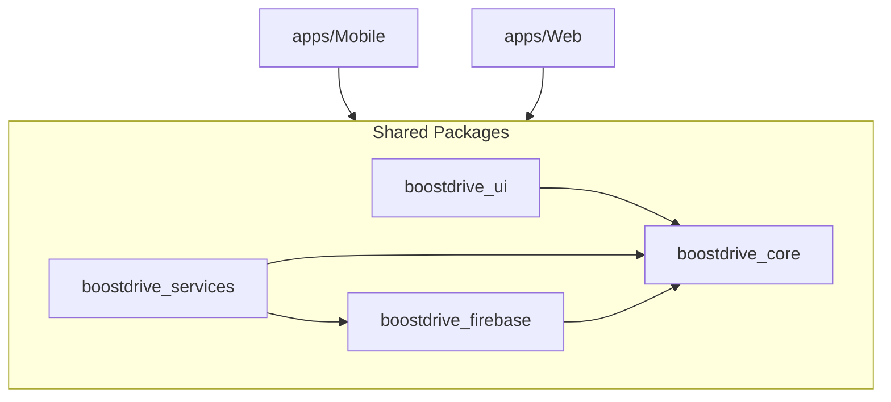

# BoostDrive Technical Architecture

This document provides an in-depth look at the architectural design and technical decisions behind the BoostDrive Ecosystem.

## 📐 Design Philosophy

BoostDrive follows a **Domain-Driven, Layered Architecture** managed within a **Melos Monorepo**. The primary goals are:
1. **Code Reuse**: ~80% of business logic and UI components are shared across Mobile and Web.
2. **Platform Independence**: Mobile-specific (location) and Web-specific (JS interop) code is isolated via conditional imports and stubs.
3. **Reactivity**: Using Riverpod to ensure the UI reacts instantly to backend changes (SOS status, Marketplace inventory).

---

## 🏗️ The Monorepo Structure

### 1. Application Layer (`apps/`)
- **`apps/Mobile`**: Handles the "Services" side of the business. 
  - *Key Logic*: Geo-tracking, SOS management.
  - *Platforms*: Optimized for iOS, Android, and Browser.
- **`apps/Web`**: Handles the "Marketplace" side.
  - *Key Logic*: Shop navigation, Booking management.
  - *Platforms*: Optimized for Desktop Browser.

### 2. Infrastructure Layer (`packages/`)
- **`boostdrive_firebase`**: 
  - Centralizes the `Firebase.initializeApp` logic.
  - Implements **Conditional Exports** for Web Authentication stubs (handling `RecaptchaVerifier` which only exists in the JS SDK).
- **`boostdrive_services`**:
  - Contains Data Access Objects (DAOs) and Service Providers.
  - *SOSService*: Real-time stream of emergency requests.
  - *ProductService*: CRUD operations for vehicle/part listings.

### 3. Presentation Layer (`packages/boostdrive_ui`)
- Uses a unified **Theme Engine** based on premium dark-mode aesthetics.
- Implements the **PremiumPageLayout** which ensures consistent backgrounds and glassmorphism effects project-wide.

### 4. Domain Layer (`packages/boostdrive_core`)
- Contains Plain Old Dart Objects (PODOs) for all data entities.
- Shared constants like `Namibia_Bounds` for map constraints.

---

## 🔐 Authentication Flow (Cross-Platform)

BoostDrive uses **Firebase Phone Auth** with a custom abstraction to handle platform differences:

1. **Web**: Uses `RecaptchaVerifier` injected into a dedicated `HtmlElementView`. The logic is stubbed out for native platforms to prevent compilation errors.
2. **Native**: Uses `verifyPhoneNumber` with automatic SMS retrieval.
3. **Abstraction**: The `AuthService` in `boostdrive_firebase` exposes a single `signInWithPhone` method that transparently chooses the correct implementation.

---

## 📡 Database Architecture (Supabase)

The migration from Firestore to Supabase introduces a relational schema with the following core tables:

| Table | Role |
| :--- | :--- |
| **`profiles`** | User profiles, role-based access metadata. Linked to Auth. |
| **`products`** | Marketplace inventory (Cars, Parts). |
| **`sos_requests`** | Time-series log of emergency triggers, coordinates, and status. |
| **`bookings`** | Rental transaction records. |
| **`orders`** | Product sales and checkout records. |

---

## 🛠️ State Management Pattern

We use **Riverpod 2.x** with the following conventions:
- **`FutureProvider`**: For one-time fetches (e.g., getting featured cars).
- **`StreamProvider`**: For live data (e.g., SOS status updates).
- **`StateProvider`**: For UI-local state (e.g., loading indicators).
- **`ChangeNotifierProvider`**: (Limited use) for complex legacy UI states.

---

## 📦 Asset Management

Assets are primarily hosted in `packages/boostdrive_ui`. However, to ensure maximum performance and bypass Flutter package path complexities during build, key "Hero" assets are duplicated into the local `apps/Mobile/assets` folder and registered in the local `pubspec.yaml`.

---

## 🚀 Deployment Strategy

1. **Web**: Deployed via **Firebase Hosting** using `flutter build web --web-renderer canvaskit`.
2. **Android**: Distributed via **Play Store** (AAB) or direct APK for logistics testing.
3. **CI/CD**: Melos-aware pipelines run `melos analyze` and `melos test` on every push.
